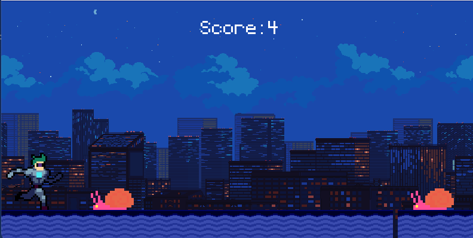

# Keep Runnin' Buddy!

  

Ein 2D-Plattformspiel entwickelt mit Python und Pygame.  
A 2D platformer game developed with Python and Pygame.

---

## Anforderungen | Requirements

- Python 3.8 oder höher | Python 3.8 or higher  
- Pygame 2.0 oder höher | Pygame 2.0 or higher  

---

## Installation

### Deutsch:  
1. Klone das Repository:  
   ```bash
   git clone https://github.com/username/keep_runnin_buddy.git
   ```  
2. Wechsel in das Verzeichnis:  
   ```bash
   cd keep_runnin_buddy
   ```  
3. Installiere die erforderlichen Python-Pakete:  
   ```bash
   pip install -r requirements.txt
   ```  

### English:  
1. Clone the repository:  
   ```bash
   git clone https://github.com/username/keep_runnin_buddy.git
   ```  
2. Navigate to the directory:  
   ```bash
   cd keep_runnin_buddy
   ```  
3. Install the required Python packages:  
   ```bash
   pip install -r requirements.txt
   ```  

---

## Ausführung | Running the Game

### Deutsch:  
Starte das Spiel mit:  
```bash
python main.py
```  

### English:  
Run the game with:  
```bash
python main.py
```  

---

## Steuerung | Controls

- **Leertaste | Spacebar**: Springe über Hindernisse | Jump over obstacles.  
- **ESC**: Spiel verlassen | Exit the game.  

---

## Spielinhalte | Game Features

### Hintergrund | Background  
- Das Spiel bietet eine animierte Stadtlandschaft, die kontinuierlich scrollt.  
  The game features an animated cityscape that continuously scrolls.  

### Hindernisse | Obstacles  
- Schnecken, die immer schwieriger werden, je länger das Spiel läuft.  
  Snails that become increasingly challenging as the game progresses.  

### Animation  
- Der Spieler hat eine Laufanimation aus einem Sprite-Sheet.  
  The player features a running animation from a sprite sheet.  
- Hindernisse wechseln zwischen Animationen.  
  Obstacles alternate between animations.


---

## Wie füge ich Bilder in die README ein? | How to Add Images to the README

1. **Deutsch:**  
   - Erstelle einen Ordner namens `screenshots` im gleichen Verzeichnis wie die README-Datei.  
   - Speichere deine Bilder dort und verlinke sie mit dem folgenden Markdown-Format:  
     ```markdown
     
     ```  

2. **English:**  
   - Create a folder named `screenshots` in the same directory as the README file.  
   - Save your images there and link them using the following Markdown format:  
     ```markdown
     
     ```  

---

## Lizenz | License

### Deutsch:  
Dieses Projekt steht unter der MIT-Lizenz.  
This project is licensed under the MIT License.  

### English:  
Feel free to modify and distribute the code under the terms of the MIT License.  

---

Jetzt kannst du die gesamte README mit einem einzigen Kopieren-Befehl übernehmen. 😊